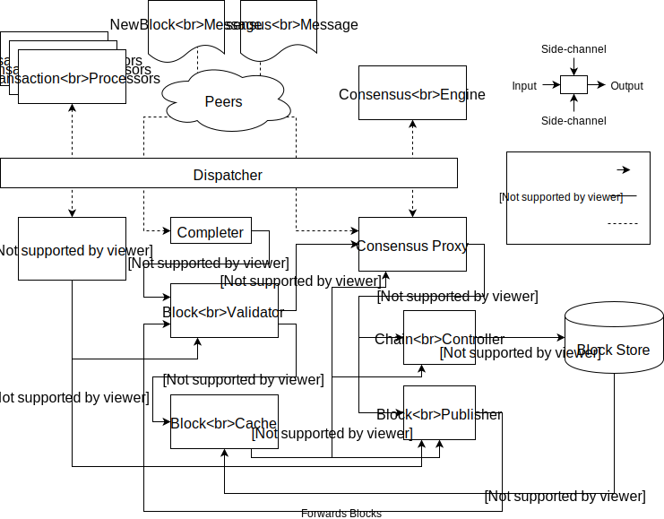

- Feature Name: consensus-api
- Start Date: 2018-03-15
- RFC PR: [hyperledger/sawtooth-rfcs#4](https://github.com/hyperledger/sawtooth-rfcs/pull/4)
- Sawtooth Issue: N/A

# Summary
[summary]: #summary

This RFC describes a new Consensus API for supporting both the existing
_lottery_ consensus algorithms as well as _voting_ algorithms
such as rBFT.

# Motivation
[motivation]: #motivation

The motivation for this RFC is to support integrating new non-lottery-based
consensus mechanisms with Sawtooth, such as raft and rBFT, while continuing to
support PoET/SGX, PoET/Simulator, and devmode consensus algorithms.

# Guide-level explanation
[guide-level-explanation]: #guide-level-explanation

The Consensus API was developed after researching a variety of consensus
algorithms, consensus interfaces, and the consensus problem in general. Out of
this research came the following observations:

1. All consensus algorithms describe a state machine.
2. All consensus algorithm state transitions occur as a result of:

    a. Receiving a consensus message from a peer
    b. Receiving a message from a client
    c. An internal interrupt

These observations led to the creation of the _Consensus Engine_ abstraction,
which can be used to implement any consensus algorithm that is either a
_voting_ (classical) algorithm or a _lottery_ (Nakamoto-style) algorithm.

## Comparison of Algorithm Types

The following describes the differences between what we refer to as _voting_
and _lottery_ algorithms for the purpose of understanding how both are handled
by the consensus interface.

In _voting_ consensus algorithms:

- A single node is authorized to make commits at any given time.
- One or more nodes in the network is required to maintain a "global view" of
  the network.
- Adding and removing nodes from the network is non-trivial and requires
  coordination and network-wide agreement.
- Many "consensus-specific" messages are passed between nodes on the network to
  coordinate consensus.

Examples of _voting_ algorithms include PBFT, rBFT, Tendermint, and
Raft.

In _lottery_ consensus algorithms:

- All nodes are authorized to make commits at any given time.
- Nodes need only be aware of their peers on the network (not all nodes).
- Adding and removing nodes is trivial; the network supports "open-enrollment".
- There are no "consensus-specific" messages; consensus is an emergent property
  of the fork-resolution logic.

Examples of _lottery_ consensus algorithms include Proof-of-Work (PoW)
and Proof-of-Elapsed-Time (PoET).

## Overview of the Consensus Engine

The Consensus Engine lives in a separate process and interacts with the
Validator using protobuf messages.

The Consensus Engine is responsible for:

- Determining messages to send to peers
- Sending commands to progress the blockchain
- Reacting to internal interrupts and a limited set of external messages

The Consensus Engine is not responsible for:

- Validating the integrity of blocks, batches, transactions
- Validating block, batch, transaction, or message signatures
- Gossiping blocks, batches, or transactions
- Block storage, block creation, and (direct) management of the chain head

# Reference-level explanation
[reference-level-explanation]: #reference-level-explanation

## Requirements

The following is a list of necessary requirements for the Sawtooth
architecture to be able to support both classes of consensus algorithms:

**R1 - Consensus-Specific Messaging**

At a minimum, an efficient communication channel for sending consensus messages
between network nodes is needed. This channel must support both broadcast and
peer-to-peer messaging.

**R2 - Separate Consensus Process**

Implementing consensus algorithms is expensive. It must be possible to reuse
existing implementations to the extent possible. For this reason, it must be
possible to run consensus in a separate process.

**R3 - Consensus-Driven Block Publishing and Chain Updates**

In order to be efficient, the consensus algorithm must be responsible for
determining when to publish blocks and when to update the chain head.

For example, in voting algorithms, only one node is authorized to
publish blocks at any given time and the authorized node often does not change
until it is deemed faulty. In a stable environment, this could be an indefinite
amount of time. If consensus is not responsible for determining when to publish
and update the chain head, all but one nodes will be polling consensus
for long periods of time.

**R4 - Read Access to Settings**

Consensus engines need to read settings to support on-chain consensus engine
configuration using the Settings Transaction Family. PoET depends on Settings
to configure critical values such as target wait time and enclave measurements
and these values must be consistent across the network.

**R5 - Read Access to Global State**

PoET depends on tracking authorized block publishers in global state and
therefore requires read access to a PoET specific namespace.

**R6 - Reusability**

The Consensus Engine interface and implementations of the interface should be
reusable in other applications. Specifically, the interface should support
non-blockchain applications, such as distributed oracles and distributed
ledgers not focused around blocks.

## Data Structures

**Blocks**

In order to support R6, "block" is defined to mean the following data structure
within the context of the consensus engine. When used in a blockchain context,
this block definition is equivalent to those parts of the block that are
relevant to consensus. When used outside the blockchain context, the
interpretation of this data structure is context dependent.

    Block {
        Id: string               // This block's identifier
        Previous Id: string      // This block's parent's identifier
        Index: unsigned integer  // The "height" of this block
        Consensus: bytes         // The opaque consensus payload for this block
        Signer: bytes            // The signer of this block
        Summary: bytes           // A digest of the contents of the block
    }

**Consensus Messages**

In order to support arbitrary communication between nodes, a generic message
type is defined with a payload that is opaque to the validator. The following
data structure is used for this:

    ConsensusMessage {
        MessageType: string
        Payload: bytes
    }

Payload is the opaque payload to send to other nodes. The interpretation of
MessageType is left to the Consensus Engine implementation.

## API

The Consensus Engine API is split into two types of interactions between the
Validator and the Consensus Engine implementation: services and updates. The
Validator provides a set of _services_ to the Consensus Engine which are pairs
of (Request, Response) messages that allow the Engine to get information from
the Validator and send commands to the Validator. These service calls are
synchronous and on-demand. The Validator also provides _updates_ to the Engine,
which alert the Engine of new events that have occurred. Updates are sent
asynchronously as they occur.

Below is a listing of the services and updates defined by the Consensus Engine
API. Each service is implemented with a pair of (Request, Response) messages
and the Consensus Proxy is responsible for handling this transformation within
the Validator. Each update is implemented as a single Notification message and
the Consensus Notifier is responsible for creating and sending these messages
at the request of the Validator internals.

### Services

The services defined by the Consensus Engine interface are split into the
following groups:

1. P2P Messaging
2. Block Creation
3. Block Management
4. Queries

#### P2P Messaging Methods
The following methods are provided to Consensus Engines for sending consensus
messages to other nodes on the network. These methods support R1.

| Method | Description |
| --- | --- |
| SendTo(peer, message) | Send a consensus message to a specific, connected peer |
| Broadcast(message) | Broadcast a message to all peers |

#### Block Creation Methods
The following methods will be provided to Consensus Engines for controlling
block creation. These methods support R3.

| Method | Description |
| --- | --- |
| InitializeBlock() |  Initialize a new block based on the current chain head and start adding batches to it. |
| SummarizeBlock() -> digest |  Stop adding to the current block and summarize the contents of the block with a digest.  |
| FinalizeBlock(data) -> block_id | Stop adding batches to the current block and finalize it. Include the given consensus data in the block. If this call is successful, a BlockNew update will be received with the new block. |
| CancelBlock() |  Stop adding batches to the current block and abandon it. |

#### Block Management Methods
The following methods will be provided to Consensus Engines for controlling
chain updates. These methods support R3.

| Method | Description |
| --- | --- |
| FailBlock(block_id) | Mark the block as failed by consensus. This will also fail all descendants. |
| IgnoreBlock(block_id) | Mark the block as considered, but do not fail or commit the block. |
| CheckBlocks(blocks) | Check that the blocks can be successfully committed. The results of all checks will be send as BlockValid and BlockInvalid updates. |
| CommitBlock(block_id) | Set the chain head to the given block id. The Chain Controller would handle the details here. This block must already have been checked. |

#### Query Methods
The following methods will be provided to Consensus Engines for getting
information from the validator.

| Method | Description |
| --- | --- |
| GetSetting(setting) -> data | Read the current value of the setting. Supports R4. |
| GetState(address) -> data | This is needed to read values from arbitrary addresses used by consensus (eg., validator registry). Supports R5. |
| GetBlock(block_id) -> block | Retrieve consensus-related information about a block. |
| GetChainHead() -> block | Get the current committed chain head. |

While the consensus engine should maintain a cache of blocks internally, this method is provided to:
1. Allow cache entries to expire without losing the block forever
2. Allow the engine to handle getting a block before its parent

### Updates

The following updates are sent to Consensus Engines by the validator as they
happen. They are used to update the Consensus Engine on external events. These
methods support R1-R3.

| Method | Description |
| --- | --- |
| PeerConnected(peer_info) | Called when a new peer is added |
| PeerDisconnected(peer_id) | Called when a peer is dropped |
| PeerMessage(message) | Called when a new consensus message is received |
| BlockNew(block) | Called when a new block is received and validated |
| BlockValid(block_id) | Called when a block check succeeds |
| BlockInvalid(block_id) | Called when a block check fails |
| BlockInvalid(block_id) | Called when a block commit completes |

### API Contracts

A few expectations, or _contracts_, are part of this API and must be upheld by
both sides of the API in order for it to function correctly. These _contracts_
are defined below:

1. Following successful registration, `BlockNew` updates will only be sent to
   the Consensus Engine by the Validator if the block's parent has already been
   sent.

2. The Consensus Engine must "render an opinion" on every block sent to it by the
   validator by calling either `FailBlock()`, `IgnoreBlock()`, or
   `CommitBlock()`. If a Consensus Engine implementation does not uphold this
   contract, the validator will hold onto blocks in memory indefinitely,
   causing a memory leak.

3. Before a block can be committed with `CommitBlock()` it must first be
   checked with `CheckBlocks()`. Failing to check a block before committing
   will result in an error. This is to enable internal optimizations within the
   Validator such as lazily evaluating blocks after consensus has rendered an
   opinion.

4. The state of block construction within the Validator will not change without
   a request from the Consensus Engine.

## Consensus Engine Architecture Integration
The following describes the interactions between the consensus engine and the
other major architectural components of the validator.

**Consensus Engine**

The Consensus Engine is a separate process that implements a consensus
algorithm and communicates with the Consensus Proxy through the Dispatcher. It
can also communicate with peers using consensus messages. Its role is to direct
block creation and chain management. It must implement the interface described
above.

**Consensus Proxy**

The Consensus Proxy mediates interactions between the Consensus Engine and the
rest of the Validator. This includes marshaling and unmarshaling messages from
the Dispatcher, passing block notifications to the Consensus Engine, and
passing commands from the Consensus Engine to the Chain Controller and Block
Publisher.

**Consensus Notifier**

The Consensus Notifier handles marshaling and sending notifications to the
Validator. It is passed to validator components that are responsible for
sending notifications.

**Block Validator**

The Block Validator validates blocks except from the perspective of consensus.

**Chain Controller**

The Chain Controller manages both committed and uncommitted chain heads. The
Chain Controller is driven by the Consensus Engine and does not know about
block validity or consensus.

**Block Publisher**

The Block Publisher handles the creation of blocks. It is directed by the
Consensus Engine on when to do this. When a block is finalized, it is forwarded
to the Block Validator.

# Drawbacks
[drawbacks]: #drawbacks

1. Requires additional work to maintain existing consensus modules.
2. Requires work to change existing architecture.
3. Moving consensus to a separate process and requiring additional
   (de)serialization may degrade performance.

# Rationale and alternatives
[alternatives]: #alternatives

This design balances the existing architectural constraints of the validator
against the desire for an abstract, uniform consensus interface.

# Prior art
[prior-art]: #prior-art

This design borrows some ideas from the [Tendermint ABCI][tendermint] and the
[Parity Consensus Engine][parity] interface.

[tendermint]: https://tendermint.com/docs/spec/abci/
[parity]: https://github.com/paritytech/parity/blob/e95b09348386d01b71901365785c5fa3aa2f7a6d/ethcore/src/engines/mod.rs#L176

# Unresolved questions

[unresolved]: #unresolved-questions

- Should the consensus engine be able to read arbitrary locations in state?
