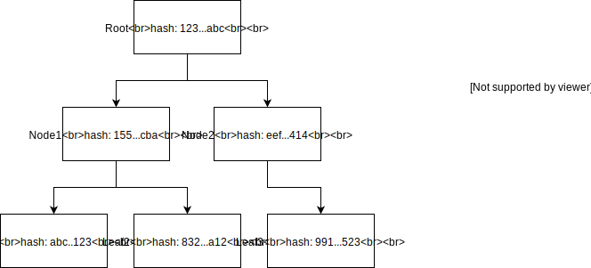
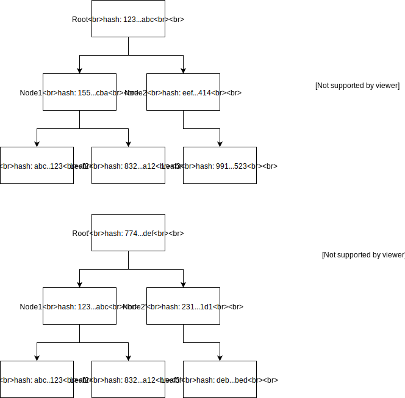

- Feature Name: state-pruning
- Start Date: 2018-03-21
- RFC PR: https://github.com/hyperledger/sawtooth-rfcs/pull/8
- Sawtooth Issue: https://jira.hyperledger.org/browse/STL-1133

# Summary
[summary]: #summary

This RFC describes a method for _State Pruning_.  State Pruning refers to the
process of discarding older roots from the Merkle-Radix trie in an effort to
manage growth of the State Database over time.

# Motivation
[motivation]: #motivation

Currently, the State Database is allowed to grow in an unconstrained manner,
consuming a large amount of disk space over the lifetime of a given ledger. This
presents significant challenges to maintaining a ledger over a long period of
time. Reducing the state database size will result in longer term stability of a
running ledger.

# Guide-level Explanation
[guide-level-explanation]: #guide-level-explanation

## Terms

* **Parent** - A Merkle trie root hash, from which the current trie is produced.
* **Succesor** - A Merkle trie which used the current trie as a parent.
* **Change Log** - A record of additions for the current trie, as well as a
  store of successors and the nodes that they deleted.
    * A change log entry is made up of references to the *Parent*, the
      *Additions* made when creating the current trie, and a map of
      *Successors* and their corresponding *Deletions* of nodes in this trie.
* **Pruning** - The operation of removing unneeded entries from parent or
  successor tries.

## Overview

The Sawtooth Merkle-Radix trie implementation is a copy-on-write data structure.
This means that only nodes that have changed, via updates or inserts, are added
to the trie and hashed.  Unchanged nodes are not modified or hashed, only
referenced by the modified nodes in the trie.  Deleted nodes are no longer
referenced, which results in the parent nodes' hashes being updated.

Along side the serialized node, a change log for a particular state root is
stored.  This change log includes the keys of values that are added, and keys of
deleted values by replaced by future state roots. The change log is written to
the database in the same LMDB transaction of the state root itself.  The deleted
values are added to trie's change log when a successor state root is produced,
and replaces keys with new values. An entry for deletions is recorded for all
successor state roots.

This change-log entry also includes the parent state-root.

Pruning operates on a state root and examines the change-log entry for nodes to
delete.

In the case where a parent node is deleted, for example the state root
of a block from some number in the past, the deleted values are examined.  If the
intersection of all successor roots delete values is empty, then all of the
deleted nodes listed are deleted from the database.

In the case where a node with no successors - that is, the state root of an
abandoned fork -  is pruned, the added keys are removed.  In this case, pruning
can proceed back up the parent chain until it reaches a state root that has
multiple successors in its delete collection.

**Database Compaction**

After a set number of pruning phases, the database has a large amount of
reclaimed space, which needs to be compacted.  This is an additional step
required to keep the overall file size smaller.  It is not an automatic process
for LMDB.

This compaction operation will be available as a subcommand of `sawadm`.

# Reference-level explanation
[reference-level-explanation]: #reference-level-explanation

## Configuration

Maximum block depth is a local configuration option.  It is set via the command
line parameter `--state-pruning-block-depth` and defaults to `1000`.

This is a local setting, as pruning helps manage local resource constraints.
Network-wide settings have no knowledge of local disk size issues.

## Change Log Storage

Change logs are stored in a child database, `change_log`, which will record
change-logs in a protobuf message.  Note, the hashes are stored as bytes, not
hex representations.

```
// An Entry in the change log for a given state root
message ChangeLogEntry {
    // A state root that succeed this root
    message Successor {
        // A root hash of a merkle trie based of this root
        bytes successor = 1;

        // The keys (i.e. hashes) that were replaced (i.e. deleted) by this
        // successor.  These may be deleted during pruning.
        repeated bytes deletions = 2;
    }

    // A root hash of a merkle trie this tree was based off
    bytes parent = 1;

    // The hashes that were added for this root. These may be deleted during
    // pruning, if this root is being abandoned.
    repeated bytes additions = 2;

    // The list of successors
    repeated Successor successors = 3;
}
```

These entries are updated in the child database during the update of the main
state database, within the same write transaction.  This preserves the
atomicity of the writes.

## Updating Entries

Collecting the hashes requires the following changes to the existing algorithm:

```
         # Rebuild the hashes to the new root
+        additions = []
+        deletions = [self._root_hash] # add the old parent
         for path in sorted(path_map, key=len, reverse=True):
             (key_hash, packed) = _encode_and_hash(path_map[path])
             update_batch.append((key_hash, packed))
+            additions.append(key_hash)
             if path != '':
                 parent_address = path[:-TOKEN_SIZE]
                 path_branch = path[-TOKEN_SIZE:]
+                if path_branch in path_map[parent_address]['c']:
+                    deletions.append(
+                       path_map[parent_address]['c'][path_branch])
                 path_map[parent_address]['c'][path_branch] = key_hash
+        additions.append(key_hash) # add the new parent
```

Storing the change log requires the following additions (in pseudo code):

```
    change_log = ChangeLogEntry(
        parent=self._root_hash,
        addition=additions)
    parent_change_log = read_change_log(self._root_hash)
    parent_change_log.append(Successor(
        successor=key_hash,
        deletions=deletions))
    write_change_logs(parent_change_log, change_log)
```

This operation is only needed if the state root is going to be persisted.

## Pruning

A state root hash selected for pruning undergoes the following operation (in
pseudo code):

```
fn prune(state_root_hash: String, change_log: Option<ChangeLogEntry>) -> bool:
    if not change_log:
        change_log = read_change_log(state_root_hash)

    if change_log.successors.len() > 1:
        # cannot prune: it is the root of multiple branches
        return False

    # pruning an abandoned succesor
    if change_log.successors.len() == 0:
        for hash in change_log.additions:
            delete(hash)

        if change_log.parent:
            parent_change_log = read_change_log(change_log.parent)
            delete_successor(parent_change_log, state_root_hash)

            // prune until we hit the fork
            if parent_change_log.successor.len() == 0:
                prune(parent, parent_change_log)

        delete_change_log(state_root_hash)
        return True
    else:
        # pruning an old root
        successor = change_log.successors[0]
        for hash in successor.deletions:
            delete(hash)

        delete_change_log(state_root_hash)
        return True
```

If these state roots are thought of from the perspective of a time dimension,
where time can fork based on different changes applied to the previous trie,
either

* A root is pruned by removing those deleted forward in time
* A root is pruned by removing those added, and its parents, until the fork in
  time is found
* A root is untouched, as it is the root of multiple forks in time

### When to Prune

After committing a block, the state root for block `Head - N`, where `N =
<maximum block depth>`, is put in a queue for pruning.  This queue is persisted,
so as not to lose the state roots slated for removal.  Likewise, when forks are
abandoned, and when they fall out of the cache, their state roots are put in the
pruning queue.

If a fork is re-established as part of the current chain, it hash is removed
from the pruning queue.

After the pruning queue is updated, and the queue has reached its max size, the
oldest item in the queue is removed and it is pruned.

## Example



The above example displays a merkle database with a single state root that
consists of three leaf values, and two intermediate nodes.  The data is omitted
as it is irrelevant to this discussion.

The change-log entry for this state root lists all the nodes as added, no parent
(it is the first root in the database), and no deletions (it has no successors).

If a new root is produced by modifying the value stored at `Leaf3`, the database
will now look like:



If state pruning was to occur against the original `Root` (`123...abc`) the
following operations would occur:

- Change-log for `Root` is read
- Since there is only one successor all keys referenced in the
  `ChangeLogEntry.Deleted` are deleted
    - Delete `123...abc1`, `eef...414`, `919...523`
- Change-log for `Root` is deleted
- Change-log for `Root'` (`774..def`) is read
    - ChangeLogEntry.Parent is set to `None`

In a running Sawtooth validator, state pruning would occur against state roots
that are either a certain depth in the trie, or abandoned forks.  The block
maximum block depth is configurable, and will default to `1000`.

## Effect on Block Validation

State pruning will have an effect on Block Validation, in that it will be
expensive to validate forks that are against blocks whose state has been pruned.
This is due to needing to recompute state up to the common ancestor of the
block. This expense is roughly mitigated by the setting of maximum block depth,
and future changes can make maximum block depth based off of a computed average
of forks and their depth.

## Database Compaction

Database Compaction in LMDB is done via a copy operation. This is processed via
the underlying LMDB api:

```
int mdb_env_copy2(MDB_env* env,
                  const char* path,
                  unsigned int flags)		
```

where the flag `MDB_CP_COMPACT` is set.  

This operation writes the database to a new path, and returns a new LMDB
Environment.  The environment can be swapped for the existing environment.

LMDB can perform this operation to be applied while still allowing writes to
happen against the original DB. The complexity with this operation is involved
around when to switch from the pre-compacted to the post-compacted database.

See the
[documenation](http://www.lmdb.tech/doc/group__mdb.html#ga3bf50d7793b36aaddf6b481a44e24244)
on the function for more detail.

This operation is implemented as part of the `sawadm` tool:

```
$ sawadm state compact
```

It must be run while the validator is stopped.

# Drawbacks
[drawbacks]: #drawbacks

The storage of the change-log increases the amount of data per trie by
duplicating the keys. This is the trade-off for making both updating and pruning
the database a fast operation.

Additionally, changing the LMDB database from a single database to two child
databases requires a migration operation. This migration can be done by
revalidating the chain and processing the new state database with pruning
enabled.  While slow for large changes, the end result would have a much smaller
disk size.

# Rationale and alternatives
[alternatives]: #alternatives

**Reference Counting**

Reference counting involves marking each node with a reference count for each
parent node.  As nodes are added, reference counts are incremented for the
remaining siblings.  During pruning, reference counts are decremented, and any
node with a reference count of zero is deleted.

While this is relatively simple, algorithmically - particularly with respect to
the prune algorithm - it requires a large number of writes per update.  Worst
case, this could involve a visit to every node in the trie.

**Minimal Copy**

An alternative to reference counting is to create a minimal copy of the database
at intervals. As the db grows to a particular size, copy the database starting
at a given root, and then apply the remaining deltas to the new database. At the
end of the copy, switch the reference to the underlying database for use in
normal operation and discard the old database.

This particular solution is simple in it's implementation, and requires no
change in the underlying data storage model.  However, it is an expensive
operation, given that a complete copy, including a walk of every trie kept is
required.

# Prior art
[prior-art]: #prior-art

Ethereum Geth has also discussed the use of state pruning for their Merkle trie
implemenation. It has not yet implemented this for its disk-based storage, but
it has implemented reference counting for its in-memory storage of the trie. See
this [blog post](https://blog.ethereum.org/2015/06/26/state-trie-pruning/) for
more information.

The current design issue for Geth can be found
[here](https://github.com/ethereumproject/go-ethereum/issues/440).

The [Parity EVM](https://github.com/paritytech/parity) uses multiple modes of
state pruning, described [here](https://ethereum.stackexchange.com/a/4327).

Hyperledger Fabric does not rely on a Merkle trie implementation but instead
relies on an instance of CouchDB or LevelDB to store the current state values.
See the section ["State
Database"](https://hyperledger-fabric.readthedocs.io/en/latest/ledger.html#state-database)
in the Fabric documentation. Given that it is the current state values only, no
pruning is necessary.

# Unresolved questions
[unresolved]: #unresolved-questions

- Can the timing for state pruning be dynamically determined via runtime
  information?  I.e. from fork volume or current state size?
- Additional savings in space could be made via state compression, though the
  precise way this would be implemented and affect reference counting remains to
  be seen.
