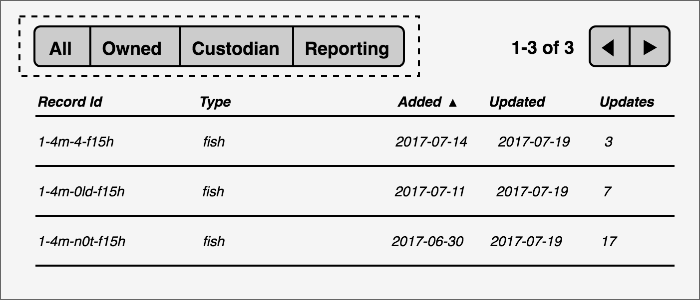
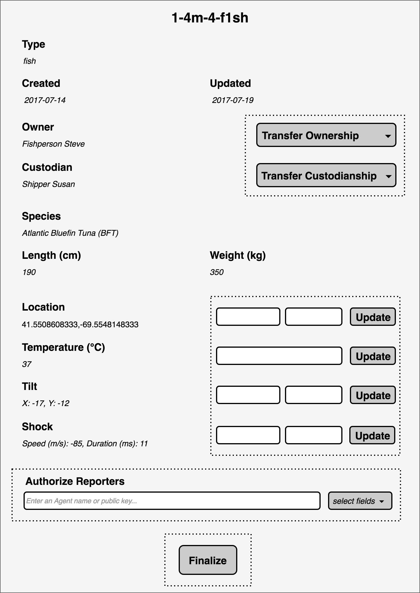

- Feature Name: supply_chain_universal_client
- Start Date: 2018-12-03
- RFC PR: [hyperledger/sawtooth-rfcs#14](https://github.com/hyperledger/sawtooth-rfcs/pull/14)
- Sawtooth Issue:

# Summary
[summary]: #summary

Develop a new Sawtooth Supply Chain client built to handle any RecordType,
which will update and replace the existing FishNet and AssetTrack clients. All
hard-coded references to specific commodities will be removed. RecordType will
be displayed with each Record, and be selectable when creating new Records.

To support this client, a new `/record-types` route will be added to the
server's API and a few properties will also be added to RecordTypes in
blockchain state. Each PropertySchema will get two new boolean flags. In
addition to "required" (must be set at Record creation), they will get
"delayed" (must _not_ be set at creation), and "fixed" (can _only_ be set at
creation). Finally, Properties will also get a new "unit" metadata string which
describes its unit of measure.

# Motivation
[motivation]: #motivation

A universal client would be very useful for both new developers experimenting
with the platform and existing developers rapidly prototyping new demos. While
more sophisticated applications may still build their own custom clients, there
would be a lot of utility in something that can be stood up without any coding
at all. All someone would have to do is create files for their sample data, run
a few scripts, and they could deploy a reasonable end-to-end
supply-chain-on-the-blockchain demo.

# Guide-level explanation
[guide-level-explanation]: #guide-level-explanation

## Client

The new universal client will in large part look like the FishNet and
AssetTrack clients it replaces. It will have the same set of pages, and those
pages will look largely identical. There will be some superficial copy and
branding changes to generalize the UI. The "unit" field will be used in
headings throughout the page to help describe properties.

More specifically, three pages will gain a new "Type" field: View Records,
Record Detail, and Add Record. They are detailed below.

### View Record Page


_*In the above mock up, dashed lines indicate elements that will only appear if
the user is logged in._

This page is largely identical to its FishNet counterpart. Type is displayed
for each Record and species has been removed. As the UI is general, it is no
longer hard coded to know that species is a particularly important field that
should be listed.

### Record Detail Page



_*In the above mock up, dotted lines indicate elements that will only appear if
the user is logged in as an Agent with the correct permissions._

The Record Detail page looks identical to the FishNet version, with the
addition of a Type field. However, under the hood it is using the "fixed" flag
to programmatically determine which Properties to display input fields for. In
FishNet, this was hard coded.

### Add Record Page


Similar to the other pages, the Add Record page gets a dropdown for "Type".
This will allow users to select any of the RecordTypes on the blockchain, which
will dynamically update the rest of the form. Properties will be pulled from
the schema, and which flags were set on them will determine how each is
handled. Required fields are marked as such and must be filled in before
submitting. Delayed fields cannot be set at all, though Reporters
can still be authorized for them. Static fields are displayed normally, but
Reporters may _not_ be authorized for them. In the mock up above, the fish type
has been selected, which has the following Properties:

- **species**: required, fixed
- **length**: required, fixed
- **weight**: required, fixed
- **location**: required
- **temperature**: _no flags_
- **tilt**: delayed
- **shock**: delayed

## REST API

In order to serve the new client, two new RecordType routes will be added:

`GET /record-types`:

Fetches all RecordTypes on the blockchain.

_Example response body:_

```json
[
  {
    "name": "fish",
    "properties": [
      {
        "name": "species",
        "type": "STRING",
        "unit": "",
        "required": true,
        "fixed": true,
        "delayed": false
      },
      {
        "name": "length",
        "type": "INT",
        "unit": "cm",
        "required": true,
        "fixed": true,
        "delayed": false
      },
      ...
    ]
  }
]
```

`GET /record-types/{type name}`

Works identically to `GET /record-types`, but fetches one particular RecordType.

## Transactions

When creating a new RecordType, there will be three new fields which can be
specified on each Property:

- **unit**: _string_, the unit of measure the Property's value will be in
- **fixed**: _boolean_, if true the value can only be set at Record creation
- **delayed**: _boolean_, if true value can only be set _after_ Record creation

As an example, the payload to create the fish type might look like this in
Python:

```python
SCPayload(
    action='CREATE_RECORD_TYPE',
    timestamp=time.time(),
    create_record_type=CreateRecordTypeAction(
        name='fish',
        properties=[
            PropertySchema(
                name='species',
                data_type=PropertySchema.DataType.STRING,
                required=True,
                fixed=True),
            PropertySchema(
                name='length',
                data_type=PropertySchema.DataType.INT,
                unit='cm',
                required=True,
                fixed=True),
            ...
            PropertySchema(
                name='shock',
                data_type=PropertySchema.DataType.STRING,
                delayed=True)
        ]))
```

After RecordType creation, interacting with these Properties would happen
normally, though there would be some extra validation rules. For example, if we
tried to update length, we would get back an error:

```json
{
  "error": "InvalidTransaction: Cannot update value of fixed Property: length"
}
```

Similarly, if attempting to create a new Record with a shock value preset would
be rejected:

```json
{
  "error": "InvalidTransaction: Cannot create Record with starting value for delayed Property: shock"
}
```

# Reference-level explanation
[reference-level-explanation]: #reference-level-explanation

## Client

Previous clients have done state on an ad-hoc basis, with individual values
tracked by the modules and pages that handle them. This will no longer be
practical in the universal client. Although it will look superficially very
similar to FishNet and AssetTrack, underneath the hood much more of the content
and formatting will be generated programmatically. RecordTypes in particular
will be used by a number of pages, but certainly do not need to be re-fetched
on each page load.

For these reasons a global state module will be introduced. This will function
mostly as a middleman for API requests, caching the responses and serving them
to pages on request. It will be a JS object with limited set of methods. As
most of the state data comes from the API, it is mostly read only, with
"refresh" methods being used to force new requests to the API as needed.

Here is what a stub of this state object might look like:

```javascript
{
  getAgents: (key = null, opts = {}) => {
    // key will limit the request to a single Agent
    // opts is optional, an object with options like query parameters
  },
  refreshAgents: (key = null, opts = {}) => {},

  getRecordTypes: (name = null, opts = {}) => {},
  refreshRecordTypes: (name = null, opts = {}) => {},

  getRecords: (id = null, opts = {}) => {},
  refreshRecords: (id = null, opts = {}) => {},

  getUser: (opts = {}) => {},
  setUser: (updatedUser) => {
    // Uses PATCH logic to update one or more user fields in the cache
  },
  refreshUser: (opts = {}) => {}
}
```

The get functions will return a cache of the data if available, and fetch it
from the API if not. In this way, HTTP requests are made only when necessary.
The refresh methods will work identically to the get methods, but forces an API
call. This will be used primarily after a transaction is submitted to update
page data.

## REST API

The Ledger Sync is already pulling RecordTypes from state and saving it to the
local database. With that in mind, hooking up `/record-types` routes would be
fairly trivial. It will follow similar patterns to existing state endpoints,
pulling the data for the most recent block and formatting it into JSON for the
client.

## Transaction Processor

In order to accommodate the new fields, there will be a few additions to the
PropertySchema protobufs messages used both to create new RecordTypes and to
save them in state. These will be backwards compatible and fairly
straightforward. The new PropertySchema message would look like this:

```protobuf
message PropertySchema {
  enum DataType {
    BYTES = 0;
    STRING = 1;
    INT = 2;
    FLOAT = 3;
    LOCATION = 4;
  }
  string name = 1;
  DataType data_type = 2;

  bool required = 3;
  bool fixed = 4;
  bool delayed = 5;

  string unit = 10;
}
```

The unit property is the simplest. It will just be piped through to state.
Static and delayed will require the validation of a few new rules on the
following transactions:

- **CreateRecord**:
  - Property values must not be delayed
- **UpdateProperties**:
  - Property values must not be fixed
- **CreateProposal**:
  - Must not be a proposal to authorize a reporter for a property which is
    fixed

# Drawbacks
[drawbacks]: #drawbacks

While it would be useful to have one canonical UI for new developers to
reference, some are already using the FishNet and AssetTrack clients, so there
might be some objections to removing them. Additionally, since hard-coded
industry-specific clients will likely continue to be developed, the argument
could be made that one should be kept for reference. However, the new universal
UI is functionally very similar to FishNet and AssetTrack, so it seems unlikely
that keeping more than one of these three clients will add much utility. If it
is important to the community that FishNet and AssetTrack be preserved, they
could perhaps be moved to their own branches or repos.

The "unit" field is not strictly speaking data, but metadata that informs how a
Record should be displayed. It could be argued that it is inappropriate to
store display information on the blockchain. However, for the humans reading
this data, in a client or otherwise, comprehension would be greatly improved by
knowing the units.

The name "delayed" for the flag that prevents a field from being set at
creation is admittedly terrible.

# Rationale and alternatives
[alternatives]: #alternatives

The previous design for deploying Supply Chain demos was to make a new
demo-specific client from scratch each time. While this is probably still the
ideal for full deployments, most demos end up being 90% copy/pastes of each
other anyway, and still take too long to stand up. This alternative is a
lightweight and simple to execute alternative. It will take a minimum of
modifications to the transaction family to build, and future demos can be stood
up with nothing but a JSON file.

Unifying the client also makes the upgrade path more clear when considering
future proposals. Rather than implementing them in multiple clients, they can
be added to the one canonical universal UI.

# Prior art
[prior-art]: #prior-art

No prior art.

# Unresolved questions
[unresolved]: #unresolved-questions

No unresolved questions. Some additional functionality might be considered in
future RFCs. Specifically, support for multiple supply chains on a single
Sawtooth Supply Chain blockchain (say that three times fast), and a Supply
Chain SDK that client developers could use to borrow the parts of the client
that are getting copied and pasted over and over again.

Additionally, the data type RFC, submitted separately, is something of a
blocker to executing this one. Support for stucts in particular will be
necessary to properly format and display many of the FishNet and AseetTrack
Properties.
